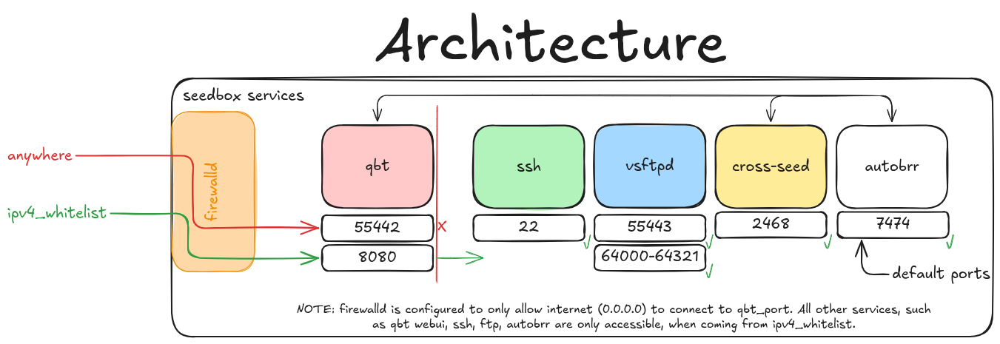

<h1 align="center">
  <br/>
luckylittle.zero_footprint_qbittorrent_seedbox
</h1>

<p align="center">

Project overview
----------------

This Ansible role provisions a standard [Red Hat Enterprise Linux 9 (RHEL 9)](https://www.redhat.com/en/technologies/linux-platforms/enterprise-linux) system as a secure, efficient and lightweight peer-to-peer (P2P) seedbox, running [qBittorrent](https://www.qbittorrent.org/).

The configuration prioritizes security and simplicity, utilizing integrated tools such as SELinux and firewalld. To maintain a minimal system footprint, it is configured for zero-logging operation and no shell history. Among others, the role incorporates [Autobrr](https://github.com/autobrr/autobrr) for modern automated downloads and [cross-seed](https://github.com/cross-seed/cross-seed) for enhanced seeding.

Please be aware that the absence of persistent logs may complicate troubleshooting, though the ephemeral journal should be sufficient for most diagnostics. This project is an enhanced fork of my [zero_footprint_rutorrent_seedbox](https://github.com/luckylittle/zero_footprint_rutorrent_seedbox) repository, simplified and adapted for qBittorrent (lot of lessons learned!). [Contributions](CONTRIBUTING.md) via pull requests are welcome.

</p>

  

Prerequisites
-------------

* A clean installation of RHEL 9 (CentOS 9 Stream should also work, but is not always tested).
* Pre-configured, passwordless Ansible access with `sudo` privileges. The [luckylittle/ansible-role-create-user](https://github.com/luckylittle/ansible-role-create-user) role may be used to establish this access.
* Access via password should also be in place (mainly due to single-user vsftpd) - e.g. `sudo passwd <user>`.

:warning: Important configuration notes :warning
------------------------------------------------

* **SSH Key Authentication is mandatory**: This role will disable password-based SSH access by setting `PasswordAuthentication no`. You must configure SSH key-pair authentication BEFORE execution to avoid being completely locked out of the system.
* **Firewall IP whitelisting**: To ensure you can access the system after the firewall is enabled, you must add your client IP address(es) to the `ipv4_whitelist` variable. Failure to do so will result in a system lockout as well.

Architecture
------------



Role Variables
--------------

[Default variables](defaults/main.yml) are:

[Common (section 1)](tasks/01-common.yml):

* `set_google_dns` - if `true`, it will add Google DNS servers to the primary interface. Defaults to true.
* `set_timezone` - change the time zone of the server, defaults to Australia/Sydney.
* `sysctl_tunables` - on/off for various tuning options in [sysctl.yml](vars/sysctl.yml). Default is on.

_Note:_ Lot of the tasks rely on `remote_user` / `ansible_user` variable (user who logs in to the remote machine via Ansible). For example, it creates directory structure under that user.

[qBt (section 2)](tasks/02-qbt.yml):

* `qbt_port` - what port should qBittorrent listen on. Default is **55442**.
* `qbt_ver` - what version should be used/installed?

[vsFTPd (section 3)](tasks/03-vsftpd.yml):

* `ftp_port` - what port should vsftpd listen on. Default is **55443**.
* `pasv_port_range` - what port range should be used for FTP PASV, by default this is **64000-64321**.
* `single_user` - when `true` only one FTP user will be used and it is the same username who runs this playbook. :warning: When `false`, [this](files/vsftpd/users.txt) file is used, update accordingly :warning: This is now true by default.

[Tools (section 4)](tasks/04-tools.yml):

* `autobrr_ver`, `mkbrr_ver` & `sizechecker_ver` etc. - contains the latest [Autobrr](https://github.com/autobrr/autobrr/releases), [Mkbrr](https://github.com/autobrr/mkbrr), [Sizechecker](https://github.com/s0up4200/sizechecker/releases) and [tqm](https://github.com/autobrr/tqm/releases) versions.
* `cross_seed` - Optional installation and configuration of the latest [cross-seed](https://github.com/cross-seed/cross-seed/releases) automation tool. Default is true.

[Security (section 5)](tasks/05-security.yml):

* `ipv4_whitelist` - what IP addresses should be used in the **firewalld** zone for access to services. Default whitelisted is arbitrary address `X.X.X.X`. :warning: You **need** to [change it](defaults/main.yml#L27) to your own :warning:

_Example:_ `192.168.0.0/16 10.0.0.0/8 172.16.0.0/12 123.222.11.111`

[Reboot (section 7)](tasks/07-reboot.yml):

* `require_reboot` - does the machine require reboot after the playbook is finished. It is recommended & default to be true.

[Role variables](vars/main.yml) are also tunable, but it is not recommended to change them unless you know what you are doing.

Dependencies
------------

* Ansible core v`2.16.14`
* community.general v`11.2.1` (Install with: `ansible-galaxy collection install community.general`)
* community.crypto v`3.0.3` (Install with: `ansible-galaxy collection install community.crypto`)
* ansible.posix v`2.1.0` (Install with: `ansible-galaxy collection install ansible.posix`)

Example Playbook
----------------

`time ansible-playbook -i inventory -u ansible test.yml`

```ini
[seedbox]
123.124.125.126
```

```yaml
---
- hosts: seedbox
  name: Playbook for zero_footprint_qbittorrent_seedbox role
  roles:
    - "zero_footprint_qbittorrent_seedbox"
```

Testing
-------

|OS        |Version 0.0.1     |
|----------|------------------|
|9.6 (Plow)|:white_check_mark:|

On a brand new Red Hat Enterprise Linux release 9.6 (Plow) on AWS (t3.medium - 2 vCPU, 4GiB RAM), it took 13m 38s.
The following versions were installed during the last RHEL9 test:

|Package name |Package version          |
|-------------|-------------------------|
|curl         |7.76.1-31.el9_6.1.x86_64 |
|tar          |1.34-7.el9.x86_64        |
|tuned        |2.25.1-2.el9_6.noarch    |
|vsftpd       |3.0.5-6.el9.x86_64       |

The following Terraform can be used to create necessary infrastructure (based on RHEL9.X on AWS):

<details>

```hcl
# Configure the AWS Provider
provider "aws" {
  region = "ap-southeast-2"
}

# Variable
variable "key_name" {
  type        = string
  default     = "ec2-pair"
  description = "AWS Key-pair"
}

# Find latest RHEL 9 AMI
data "aws_ami" "rhel9" {
  most_recent = true
  owners      = ["309956199498"] # Red Hat's AWS account ID

  filter {
    name   = "name"
    values = ["RHEL-9*"]
  }

  filter {
    name   = "architecture"
    values = ["x86_64"]
  }

  filter {
    name   = "virtualization-type"
    values = ["hvm"]
  }

  filter {
    name   = "root-device-type"
    values = ["ebs"]
  }
}

# Create a security group
resource "aws_security_group" "rhel9_sg" {
  name        = "rhel9_sg"
  description = "Security group for RHEL 9 EC2 seedbox instance"

  tags = {
    Name = "RHEL9-SecurityGroup"
  }
}

resource "aws_vpc_security_group_ingress_rule" "allow_all" {
  security_group_id = aws_security_group.rhel9_sg.id
  cidr_ipv4         = "0.0.0.0/0"
  ip_protocol       = "-1"
  description       = "Generally a bad practice, but we need to test firewalld functionality"
  tags = {
    Name = "allow_all"
  }
}

resource "aws_vpc_security_group_egress_rule" "allow_all_traffic_ipv4" {
  security_group_id = aws_security_group.rhel9_sg.id
  cidr_ipv4         = "0.0.0.0/0"
  ip_protocol       = "-1" # semantically equivalent to all ports
}

resource "aws_vpc_security_group_egress_rule" "allow_all_traffic_ipv6" {
  security_group_id = aws_security_group.rhel9_sg.id
  cidr_ipv6         = "::/0"
  ip_protocol       = "-1" # semantically equivalent to all ports
}

# Create an EC2 instance
resource "aws_instance" "rhel_instance" {
  ami                    = data.aws_ami.rhel9.id
  instance_type          = "t3.medium"
  vpc_security_group_ids = [aws_security_group.rhel9_sg.id]
  key_name               = var.key_name # Replace with your key pair name

  root_block_device {
    volume_size = 15
    volume_type = "gp3"
    encrypted   = true
    tags = {
      Name = "RHEL-9-Seedbox"
    }
  }

  ebs_block_device {
    device_name           = "/dev/sdb"
    volume_size           = 15
    volume_type           = "gp3"
    encrypted             = true
    delete_on_termination = true
    tags = {
      Name = "RHEL-9-Seedbox"
    }
  }

  user_data = <<EOF
#!/bin/bash
# Log all output for debugging
exec > >(tee /var/log/user-data.log) 2>&1
echo "Starting user data script at $(date)"
# Wait for the EBS volume to be available
echo "Waiting for EBS volume to be available..."
while [ ! -e /dev/nvme1n1 ]; do
  echo "Waiting for /dev/nvme1n1..."
  sleep 5
done
echo "EBS volume /dev/nvme1n1 is available"
# Create partition on the EBS volume
echo "Creating partition on /dev/nvme1n1..."
(
echo n # Add a new partition
echo p # Primary partition
echo 1 # Partition number
echo   # First sector (Accept default: 1)
echo   # Last sector (Accept default: varies)
echo w # Write changes
) | fdisk /dev/nvme1n1
# Wait a moment for the partition to be recognized
sleep 5
# Format the partition with XFS
echo "Formatting /dev/nvme1n1p1 with XFS..."
mkfs.xfs /dev/nvme1n1p1
# Get the UUID of the new partition
echo "Getting UUID of the partition..."
UUID=$(blkid -s UUID -o value /dev/nvme1n1p1)
echo "UUID: $UUID"
# Add entry to /etc/fstab
echo "Adding entry to /etc/fstab..."
echo "UUID=$UUID /home xfs defaults 0 0" >> /etc/fstab
# Create a temporary mount point to preserve existing home data
echo "Creating temporary mount point..."
mkdir -p /mnt/temp_home
# Mount the new volume temporarily
mount /dev/nvme1n1p1 /mnt/temp_home
# Copy existing /home contents to the new volume (if any)
if [ "$(ls -A /home 2>/dev/null)" ]; then
  echo "Copying existing /home contents to new volume..."
  cp -arv /home/* /mnt/temp_home/
fi
# Unmount the temporary mount
umount /mnt/temp_home
rmdir /mnt/temp_home
# Mount the new volume to /home
echo "Mounting new volume to /home..."
mount -av
# Reload systemd daemon
systemctl daemon-reload
# Verify the mount
echo "Verifying mount..."
df -h /home
mount | grep /home
# Restore default SELinux security contexts
restorecon -Rv /home/
echo "User data script completed successfully at $(date)"
# Optional: Create a marker file to indicate completion
touch /var/log/user-data-complete
EOF

  tags = {
    Name        = "RHEL-9-Seedbox"
    Environment = "Dev"
  }
}

# Output the instance details
output "instance_id" {
  value = aws_instance.rhel_instance.id
}

output "instance_public_ip" {
  value = aws_instance.rhel_instance.public_ip
}

output "instance_dns" {
  value = aws_instance.rhel_instance.public_dns
}
```

</details>

To test:

1. `terraform init; terraform apply -var=key_name=<NAME_OF_THE_EXISTING_KEY_PAIR_IN_AWS>`
2. `cd zero_footprint_qbittorrent_seedbox/tests`
3. `ln -s ../../zero_footprint_qbittorrent_seedbox .`
4. Insert AWS `instance_public_ip` (step 1.) to the [inventory](tests/inventory)
5. `time ansible-playbook -i inventory -u ec2-user test.yml`

Services Installed
------------------

After you successfully apply this role, you should be able to see a similar output and access the following services:

```bash
"----------------------------------------------------------------"
"Autobrr URL:"
"http://123.124.125.126:7474/onboard"
"----------------------------------------------------------------"
"Autobrr Healthz URL:"
"http://123.124.125.126:7474/api/healthz/liveness"
"----------------------------------------------------------------"
"qBt WebUI:"
"http://123.124.125.126:8080"
"----------------------------------------------------------------"
"vsFTPd URL:"
"ftps://123.124.125.126:55443"
"----------------------------------------------------------------"
```

License
-------

MIT

Ansible Galaxy
--------------

[luckylittle.zero_footprint_qbittorrent_seedbox](https://galaxy.ansible.com/ui/standalone/roles/luckylittle/zero_footprint_qbittorrent_seedbox/)

Author Information
------------------

Lucian Maly <<lmaly@redhat.com>>

_Last update: Tue 26 Aug 2025 02:23:57 UTC_
